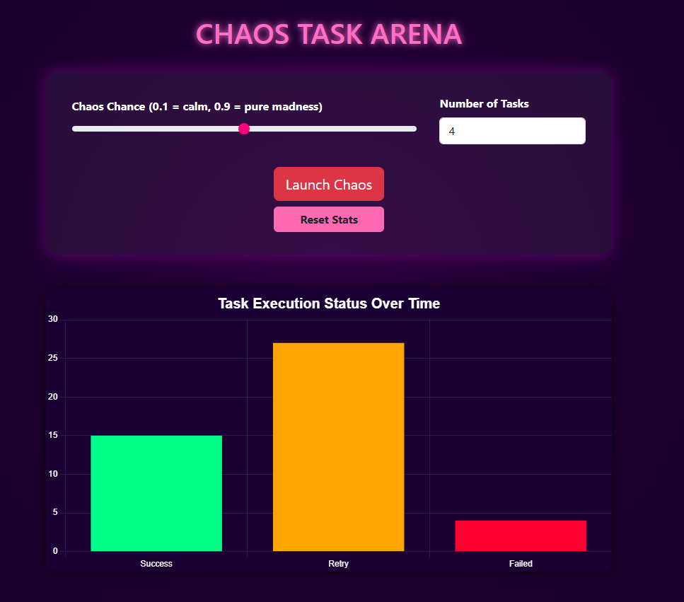

# 🧪 Chaos Task Arena

A **pet project** built to learn **Celery** and **Redis** by simulating unreliable, retrying background tasks with real-time feedback.  
Includes a Flask backend, Redis message broker, Celery workers, and a live dashboard.

---

## 📦 Tech Stack

* **Flask** – REST API + WebSocket server  
* **Celery** – Distributed task queue  
* **Redis** – Message broker and in-memory task store  
* **Flask-SocketIO** – Real-time push updates  
* **Frontend** – Charts and task metrics visualization  

---

## ⭮️ Architecture Flow

```
[User Clicks "Send 100 Tasks"]
           ↓
[Flask API triggers tasks via Celery]
           ↓
[Celery sends tasks to Redis Broker]
           ↓
[Worker executes tasks with random success/failure]
           ↓
[On retry/fail/success, log status to Redis or DB]
           ↓
[Flask-SocketIO sends real-time updates to frontend]
           ↓
[Frontend visualizes stats with charts]
```

---

## ✅ Task Status Lifecycle

```
QUEUED → STARTED → SUCCESS / FAILURE
                 ↸ (if failed) RETRY → STARTED → ...
```

* Failures are retried based on Celery retry settings.
* Transitions are logged to Redis and optionally a DB.

---

## 📊 Real-time Dashboard

Live metrics include:
- Total tasks sent
- In progress
- Succeeded
- Failed
- Retry counts

Push updates happen via WebSocket using Flask-SocketIO.

---

## 🚀 How to Run the Project

### 🔁 Option 1: Run with Docker (recommended)

> Make sure you have Docker + Docker Compose installed

```bash
docker compose up --build
```

This launches:
- `web`: Flask app + Celery worker
- `redis`: Redis broker

App will be available at: [http://localhost:5000](http://localhost:5000)

---

### 💻 Option 2: Run Locally (no Docker)

> Requires Redis running on your machine (default on `localhost:6379`)

#### 1. Install dependencies

```bash
python -m venv venv
source venv/bin/activate
pip install -r requirements.txt
```

#### 2. Start Redis manually  
Make sure you’ve installed Redis locally and run:

```bash
redis-server
```

#### 3. Launch the app

```bash
./launch.sh
```

The `launch.sh` script:
- Activates your virtual environment
- Starts the Celery worker
- Runs `server.py` (Flask + WebSocket)

---

## 🛠️ Optional Integrations

* 🐳 **Docker/Kubernetes** ready for containerized deployments  
* 🧪 **Testing & Monitoring** (pytest)

---

## 🎯 Goals

✅ Learn Celery's retry mechanics  
✅ Visualize live task updates  
✅ Explore message queue mechanics (Redis as broker)  
✅ Build a full-stack feedback loop  

---

